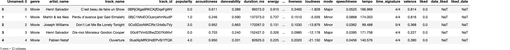
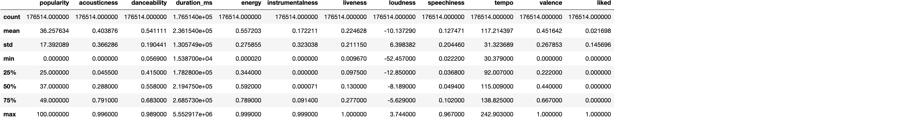

# <center>A Statistical Analysis of Music Taste</center>
# <center>The Analysis Plaground</center>
## <center>MAT 441 Applied Statistics | DePaul University</center>
## <center>Yianni Mercer | Fall 2021</center>
 <center>   <center>

### Below is a series of Python code relative to the statistical analysis portion of the project

#### Declaring the Correct Working Directory


```python
## Changing current working directory to the base root of the project, so I can maneuver between subdirectories
import os
cwd = os.getcwd() # get cwd
cwd_list = cwd.split('/')[:-1] # split the cwd on the '/' character into a list and select every item except the last one
ch = '/' # declare the '/' character
os.chdir(ch.join(cwd_list)) #Rejoin the list on the '/' character and use the os.chdir to change the current working directory
os.getcwd() # show new cwd
```


    '/Users/yiannimercer/Library/Mobile Documents/iCloud~com~getrocketbook~Rocketbook/Documents/MAT441_Applied_Stats_I/Final/spotify_liked_songs_analysis'


#### Import the Data


```python
import pandas as pd #practically tidyverse/dplyr R libraries equivalent, however many of the base R functions like read.csv come with pandas in Python (not base Python)
df = pd.read_csv("data_collection/data_files/spotify_liked_final_df.csv",parse_dates=['date_liked','liked_date']) # read in csv file by specifying file path
df.head() #print first 10 rows of the df
```


    

    


#### Minor Clean Up


```python
df = df.drop(['Unnamed: 0','date_liked'],axis=1) # Dropping the index and duplicated date_liked column that is in the data frame 
df.head()
```


    

    


#### Initial Observations


```python
print("The columns of our Data Frame: \n{}".format(df.columns))
```

    The columns of our Data Frame: 
    Index(['genre', 'artist_name', 'track_name', 'track_id', 'popularity',
           'acousticness', 'danceability', 'duration_ms', 'energy',
           'instrumentalness', 'key', 'liveness', 'loudness', 'mode',
           'speechiness', 'tempo', 'time_signature', 'valence', 'liked',
           'liked_date'],
          dtype='object')


```python
print("The shape of the Data Frame: {} \n\n\nSome basic information regarding the column in our Data Frame: ".format(df.shape))
print(df.info())
```

    The shape of the Data Frame: (176514, 20) 
    
    
    Some basic information regarding the column in our Data Frame: 
    <class 'pandas.core.frame.DataFrame'>
    RangeIndex: 176514 entries, 0 to 176513
    Data columns (total 20 columns):
     #   Column            Non-Null Count   Dtype              
    ---  ------            --------------   -----              
     0   genre             176514 non-null  object             
     1   artist_name       176514 non-null  object             
     2   track_name        176514 non-null  object             
     3   track_id          176514 non-null  object             
     4   popularity        176514 non-null  float64            
     5   acousticness      176514 non-null  float64            
     6   danceability      176514 non-null  float64            
     7   duration_ms       176514 non-null  float64            
     8   energy            176514 non-null  float64            
     9   instrumentalness  176514 non-null  float64            
     10  key               176514 non-null  object             
     11  liveness          176514 non-null  float64            
     12  loudness          176514 non-null  float64            
     13  mode              176514 non-null  object             
     14  speechiness       176514 non-null  float64            
     15  tempo             176514 non-null  float64            
     16  time_signature    176514 non-null  object             
     17  valence           176514 non-null  float64            
     18  liked             176514 non-null  float64            
     19  liked_date        2672 non-null    datetime64[ns, UTC]
    dtypes: datetime64[ns, UTC](1), float64(12), object(7)
    memory usage: 26.9+ MB
    None


```python
print("Basic Summary Descriptive Statistics of Data Frame")
df.describe()
```

    Basic Summary Descriptive Statistics of Data Frame


    

    


```python
print("Missing Values Per Each Column:")
df.isna().sum()
```

    Missing Values Per Each Column:


    genre                    0
    artist_name              0
    track_name               0
    track_id                 0
    popularity               0
    acousticness             0
    danceability             0
    duration_ms              0
    energy                   0
    instrumentalness         0
    key                      0
    liveness                 0
    loudness                 0
    mode                     0
    speechiness              0
    tempo                    0
    time_signature           0
    valence                  0
    liked                    0
    liked_date          173842
    dtype: int64


```python

```
